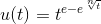
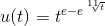
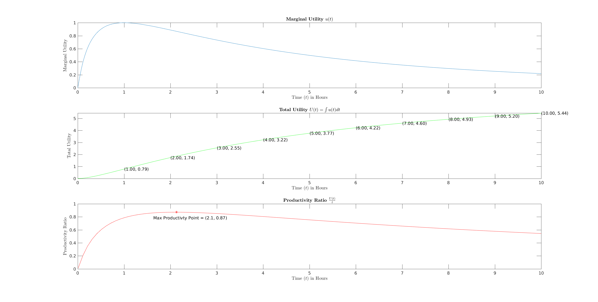

# Introduction
In the following few pages, I shall present a conjecture on how the short run returns of studying could be modeled using an appropriate utility function.

This conjecture rests on several assumptions:

<ol>
<li>Our marginal returns gained from studying (knowledge gained, better grade on test, better understanding of the material, etc.) can be measured with a utility function u(t) where 0 <= u(t) <= 1.0 and t is the amount of time we have been studying.</li>
<li>u(t) is a continuous function.</li>
<li> When we first begin a study session, our initial marginal returns are low as a result of our need to reorient ourselves with the material (u(0) = 0). This is especially true when we begin reading a chapter that we have already partially read, start working on a problem set that we have already done work on previously, start working on project X where project X represents a partially complete project, etc.. </li>
<li> As we better orient ourselves with the material, our marginal returns increase rapidly until they reach a global maximum, which we will denote as u(t=tmax) = 1.0.  </li>
<li> After we have reached this point of maximum marginal returns, our marginal returns immediately begin to diminish, but at a much slower rate than the rate at which they had initially rose (i.e. the rate at which the marginal returns rose from t=0 to t=tmax).</li>
<li> As t approaches infinity, u(t) approaches zero.</li>
</ol>

# Finding an Appropriate Utility Function

After some exploration (and with some inspiration from the design of fuzzy logic membership functions) I stumbled upon the following function:

Let us make two final assumptions.

<ol start="7">
<li> u(5 hours) = 0.5. That is, after studying for 5 hours the marginal return is half the value of u(tmax).</li>
<li> tmax = 1 hour.</li>
</ol>

I have separated assumptions 7 and 8 from our original 6 assumptions on the basis that I believe they require a much greater leap of faith. As such, I am not as confident in these final two assumptions as I am with the original 6. Luckily, the validity of assumption 7 has only a minor impact on our final result (namely, the value of n, as I will now show). 

Given assumption 7, we can set n=11.7, which reduces u(t) to the following:

# Exploring Our Results

Using MATLAB, I have produced a graph of this utility function (where n=11.7) as well as a graph of its antiderivative, which I have labeled U(t). I have also produced a graph of the resulting productivity function, which is the ratio of U(t) and t.

The aforementioned graphs are displayed below; however, they are difficult to view in GitHub. You can also view and/or download an image of the graphs [here](img/graphs.png). Alternatively, the MATLAB code used to produce these graphs has been included in this repository as well. The code is contained in [graphs.m](graphs.m). 

# Discussion

Let us begin by assuming that this function does indeed accurately reflect the utility one could expect to gain from a study session, which I believe it more or less does (excluding assumptions 7 and 8 of which are admittedly a bit of a stretch).

If we can concede that u(t) relates time to the instantaneous utility of a study session then we must also concede that its antiderivative, U(t), relates time to the total utility gained in that study session plus or minus some constant. This constant of integration could perhaps represent the unique potential of the individual or could instead be a combination of various forms of cognitive "capital," such as how well rested the individual is, how well nourished they are, how healthy they are, etc.. I will not dwell on this constant, however, as the topic is beyond the scope of this project. 

### Maximizing Returns

For a student with a desire to make the most of her study sessions, the question then becomes how she can maximize her total returns. Our first instinct may be to think that maximizing returns is equivalent to maximizing U(t). And this conclusion, within the limited scope of our aforementioned assumptions, would be correct; however, this approach would miss the bigger picture. 

After all, our understanding of this utility function works under the limiting assumption that u(t) is continuous (assumption #2), but in the real-world we do not need to study in a strictly continuous manor; we are free to break our study time into discrete sessions if we so choose. Splitting your study time up in this way is, in fact, recommended. With this realization, the goal now shifts from maximizing U(t) to maximizing the productivity of U(t), which can be measured by the ratio U(t)/t. The graph of this ratio is illustrated in the third plot from the top in the figure above. 

Why is this so? The answer to this question lies in an analogy to the economist's requirements of a short run production function, a function which u(t) most certainly bares resemblance to. Specifically, the "short run" from an economical viewpoint refers to a period of time in which there is at least one fixed factor input.

The fact that many of the variables that returns depend on are static in the short run is the very reason that returns diminish in the short run. The remedy I propose is simple. After you have reached the point of maximum productivity (which would be after 2.1 hours according to our model, which should not be taken too seriously from a quantitative standpoint), I recommend you take a longer break. The goal here is to replenish your mind (I would like to imagine that t has been reset to 0 after an ideal long break). After this break, you should do your best to change as many input variables as possible. Change your study location, start studying a different topic or course, and perhaps even try and study from a different medium (if you were previously reading a textbook, try now to watch a lecture or educational video instead).

After the ideal study break and ideal change of input variables, my hypothesis is that the utility function u(t) will once again be an appropriate model for your expected returns where t has now been reset to 0 and the graph has been left unchanged.
